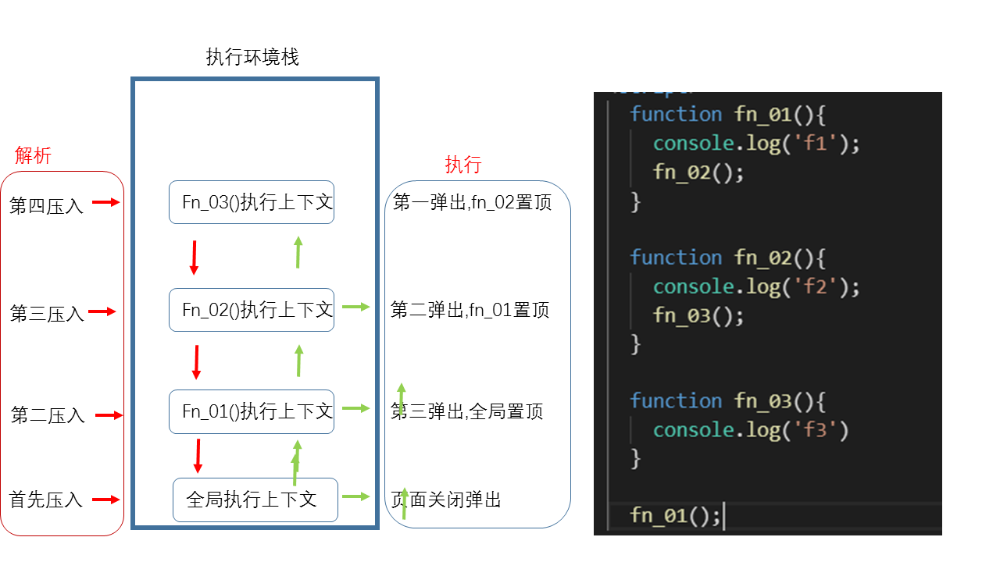

## 函数参数值传递和引用传递

* 函数的参数，如果是简单类型会将这个值的副本传到函数内部，如果是引用类型，会将引用类型的地址复制到函数内部

  ```
  let a = 9;
  let b = [1,2];
  
  function move(a,b){
    a = 12;
    b[0] = 10;
  }
  
  move(a,b);
  console.log(a,b);  // 9  10,2
  ```


## 事件循环机制

* JS执行线程和UI线程是互斥的，JS线程优先级高，在执行它时，UI线程会停止工作
* JS事件是以队列的形式来运行的，如果其中有异步任务，会执行其一部分的代码，然后放入监听区，等待其余同步任务执行完成后，再将其加入事件队列，由JS主线程处理剩下的代码(不严谨)


## 函数执行上下文

* 栈结构
* EC：函数执行环境(上下文)，Execution Context
* ECS : 执行环境栈，Execution Context Stack
* 执行上下文的执行线
  * JS执行在单线程上，所有的代码都是排队执行。
  * 一开始浏览器执行全局的代码时，首先创建全局的执行上下文，压入执行栈的顶部。
  * 每当遇到一个函数的执行块就会创建该函数的执行上下文，并且把它压入执行栈的顶部。当前函数执行完成后，当前函数的执行上下文出栈，并等待垃圾回收。
  * 浏览器的JS执行引擎总是访问栈顶的执行上下文。
  * 全局上下文只有唯一的一个，它在浏览器关闭时出栈(个人猜测页面关闭时可能也会关闭)。
  * 


#### 执行上下文的生命周期

* 创建阶段
  1. 生成变量对象
  2. 建立作用域链
  3. 确定this指向
* 执行阶段
  1. 变量赋值
  2. 函数引用
  3. 执行其他代码
* 执行完毕，出栈，等待销毁


#### VO 和 AO

* VO变量对象(Variable object)
* AO激活对象(Activation object)
* 创建阶段
  1. 创建作用域链
  2. 创建VO / AO ：首先初始化函数的参数arguments对象，初始化函数声明，初始化变量(undefined)，函数声明的优先级要高于变量，如果变量和函数重名，变量会被忽略
  3. 扫描上下文中的函数声明(非函数表达式，这也就是为什么只有使用函数声明创建出的函数才会被提升)，初始化参数(参数为实定的值，非undefined)和变量。
* 执行阶段
  1. 执行变量赋值、代码执行
* 回收阶段
  1. 执行上下文出栈等待回收销毁


#### 变量提示和函数提升

* 函数提升优先级高于变量提升
* 变量只会提升本身，不会提升值，提升后的变量暂时处于undefined状态
* `let`、`const`以及`class`这些ES6创建语句没有提升特性

>* 在函数中使用`var/let/const a = b = 7;` 这种变量声明方式，b不会享受到`var`的作用效果，也就是会创建一个隐式的全局变量，如果你在执行完这个函数后尝试在全局中获取b，你会发现你成功得到它了。定义两个或多个局部变量的正确姿势为：`var/let/const  a = 7, b=7...`


#### JS中函数没有重载

原因：JS中的函数不能重名，因为所有的函数声明都会在VO / AO身上创建一个同名属性，重复的函数会顶替到这个属性，导致前面声明的函数被覆盖

* 可以通过判断arguments对象来模拟重载


#### 斐波那契数列

```
f(n) = f(n-1) + f(n-2)
```


#### 函数的length为形参的数量


#### JS垃圾回收机制

> JavaScript具有自动垃圾回收机制(GC:Garbage Collecation)，不需要程序员关于内存的申请和回收

* 运行机制(周期性)

  JS中最常用的垃圾回收方式就是标记清除，从程序开始执行，JS会给每一个进入环境的元素打上 ‘入场标记’ ，当这个元素离开环境且不再被访问到时，JS又会给它打上一个 '离开标记' ，这样在下一个垃圾回收时，就会将这些带有 ’ 离开标记‘ 的元素清理掉。 (大概是这么回事吧...)

* IE6中的垃圾回收

  IE6的垃圾回收是根据内存分配量运行的，当环境中存在256个变量、4096个对象、64k字符串中的其中一种情况时，垃圾回收就会启动，这就导致了，我们在一个JS比较复杂的页面时，IE6的垃圾回收会不断的被频繁触发，导致我们的页面异常的卡顿，这是因为垃圾回收和JS解析是互斥的，垃圾回收的时候，JS解析引擎会停止工作。

* 针对上面的Bug，IE7中做了调整，触发条件不再是固定的，而是动态修改的，它的初始值和IE6相同，但是当每次清理完内存后，垃圾回收系统都会进行一个判断，如果本次清理的垃圾只占到了全部内存分配的不到15%，这说明，本次的清理过于敏感，这时，垃圾回收系统会将下一次的触发条件翻倍；如果清理的垃圾对比分配内存占到了85%以上，这说明，本次的清理过于迟缓，垃圾回收系统就会对触发条件的数值进行相应的回调（或者直接置回初始值）。


#### 配合垃圾回收机制的一些小技巧

* null类型是垃圾回收的其中一个标识符，如果有不再用到的变量，你可以将它设置为null
* 公共对象尽量不要创建在循环里面，虽然JS中的for循环没有作用域，不会重复声明一个变量，但是后面赋值的内容，JS会在循环中去不断申请内存。


#### 正则元字符

| 元字符 | 说明说明                       |
| :----- | ------------------------------ |
| \d     | 匹配数字                       |
| \D     | 匹配任意非数字的字符           |
| \w     | 匹配字母或数字或下划线         |
| \W     | 匹配任意不是字母、数字、下划线 |
| \s     | 匹配任意的空白符               |
| \S     | 匹配任意不是空白符的字符       |
| .      | 匹配除换行符以外的任意单个字符 |
| ^      | 表示匹配行首的文本（以谁开始） |
| $      | 表示匹配行尾的文本（以谁结束） |
| \n     | 换行                           |


##### 正则限定符

| 限定符 | 说明                       |
| ------ | -------------------------- |
| *      | 重复零次或更多次，贪婪模式 |
| +      | 重复一次货更多次，贪婪模式 |
| ？     | 重复零次或一次，非贪婪模式 |
| {n}    | 重复n次                    |
| {n,}   | 重复n次或更多次            |
| {n,m}  | 重复n到m次                 |

#### 相关括号

| 括号 | 说明                           |
| ---- | ------------------------------ |
| []   | 只要满足[]内的一项就可以       |
| [^]  | 表示取反，只要不是[]内的都可以 |
| \|   | 或者                           |
| ()   | 提高优先级                     |

#### 修饰符

| 标志 | 说明                |
| ---- | ------------------- |
| i    | 忽略大小写          |
| g    | 全局匹配            |
| gi   | 全库匹配+忽略大小写 |
| m    | 多行                |

#### Error对象

